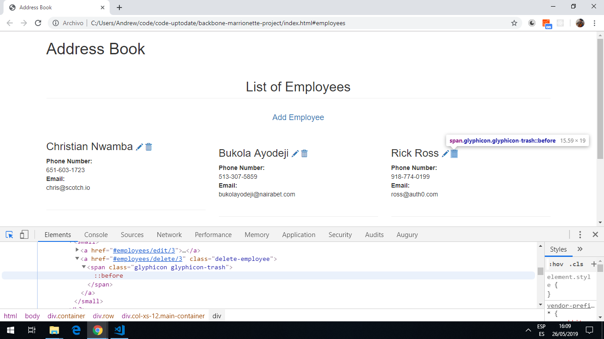
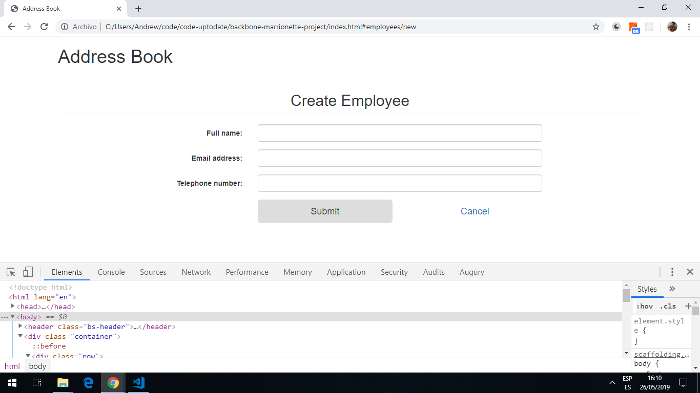

# Backbone Employee Project

Tutorial project using the [Backbone.js library](https://backbonejs.org/#) together with [jQuery](https://code.jquery.com/).

*** Note: to open web links in a new window use: _ctrl+click on link_**

## Table of contents

* [General info](#general-info)
* [Screenshots](#screenshots)
* [Technologies](#technologies)
* [Setup](#setup)
* [Features](#features)
* [Status](#status)
* [Inspiration](#inspiration)
* [Contact](#contact)

## General info

* BackboneJS architecture contains the following modules −


HTTP Request
Router
View
Events
Model
Collection
Data Source

Some apps are too small to need building with an SPA framework such as Angular. The simplicity and interactivity of a jQuery-based application can be combined with the well-structured building blocks from Backbone.js to create interactive pages with code organization and structure.

## Screenshots




## Technologies

* [Backbone.js library v1.4.0](https://backbonejs.org/#)

* [Bootstrap v3.4.0 from Content Delivery Network (cdn)](https://getbootstrap.com/)

* [jQuery v3.4.1 from cdn](https://code.jquery.com/)

## Setup

* runs from index.html in browser.

## Code Examples

```javascript
EmployeeManager.Views.Employee = Backbone.View.extend(
	{ 
		tagName: 'li', 
		className: 'media col-md-6 col-lg-4', 
		template: _.template($('#tpl-contact').html()),

		events: { 
			'click .delete-employee': 'onClickDelete' 
		},

		initialize: function() { 
			this.listenTo(this.model, 'remove', this.remove);
		},

		render: function() {
			var html = this.template(this.model.toJSON()); 
			this.$el.append(html);
			return this; 
		},

		onClickDelete: function(e) {
			e.preventDefault(); 
			this.model.collection.remove(this.model); 
		} 
	}
); 

```

## Features

employees can be added and deleted. Code exists to add svg-13 avatars but I couldn't find a free source.

## Status & To-Do List

* Status: simple working backbone.js app.

* To-Do: add functionality. Find free source of avatars.

## Inspiration

* [BackboneJS - Quick Guide](https://www.tutorialspoint.com/backbonejs/backbonejs_quick_guide.htm)

* [Auth0: BackboneJS: Getting Started](https://auth0.com/blog/backbonejs-getting-started/#Understanding-Key-Concepts-in-BackboneJS)

## Contact

Repo created by [ABateman](https://www.andrewbateman.org) - feel free to contact me!
